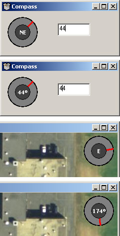



## Compass Control

### Description

Custom Compass control, will show direction or degrees.

Private Sub Text1_Change()

'some basic error checking

If Val(Text1.Text) > 359 Then

Text1.Text = (Val(Text1.Text) - 360)

End If

'call the control

Compass.Value = Text1.Text

End Sub

Easy example of using sin in graphics applications.
 
### More Info
 
.Value

             |
---                |---
**Submitted On**   |2005-03-21 11:11:04
**By**             |[Onmitsu](https://github.com/Planet-Source-Code/PSCIndex/blob/master/ByAuthor/onmitsu.md)
**Level**          |Intermediate
**User Rating**    |4.3 (17 globes from 4 users)
**Compatibility**  |VB 6\.0
**Category**       |[Custom Controls/ Forms/  Menus](https://github.com/Planet-Source-Code/PSCIndex/blob/master/ByCategory/custom-controls-forms-menus__1-4.md)
**World**          |[Visual Basic](https://github.com/Planet-Source-Code/PSCIndex/blob/master/ByWorld/visual-basic.md)
**Archive File**   |[Compass\_Co1866243212005\.zip](https://github.com/Planet-Source-Code/onmitsu-compass-control__1-59560/archive/master.zip)

